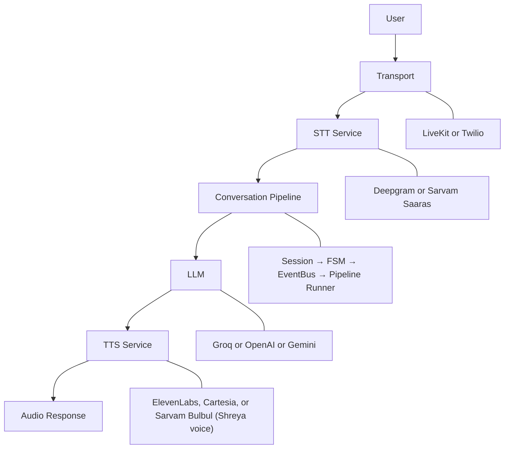

<h1 align="center">Real-Time Voice Pipeline</h1>

<p align="center">
  <a href="https://python.org">
    
  </a>
  <a href="https://fastapi.tiangolo.com">
    
  </a>
  <a href="https://pipecat.ai">
    
  </a>
</p>

## 1. Project Overview
This project is a **real-time conversational AI voice assistant backend** built around a highly modular, decoupled architecture. 

It provides an orchestration framework capable of handling streaming audio and bridging state-of-the-art AI models with zero-latency overhead. The core system manages complex conversation lifecycles, event dispatching, and error recovery natively.

**The system currently integrates:**
- Session Management
- Conversation State Machine
- Event Bus
- Pipeline Builder & Runner
- Pipecat Runtime
- LiveKit Transport
- Twilio Telephony Transport
- Deepgram / Sarvam STT
- Groq / OpenAI LLM
- ElevenLabs / Cartesia / Sarvam TTS (including Shreya voice)

*(Note: Prior WebRTC integrations such as Daily have been migrated exclusively to LiveKit).*

## 2. Architecture Diagram



## 3. Features 

| Feature                               | Description                                                                                                                             |
| ------------------------------------- | --------------------------------------------------------------------------------------------------------------------------------------- |
| 🎙️ **Real-time Voice Conversations** | Zero-perceptible latency streaming for natural conversations.                                                                           |
| 👥 **Multi-session Support**          | Fully isolated, thread-safe concurrent sessions.                                                                                        |
| ⚡ **Event-driven Architecture**       | Asynchronous pub/sub communication powered by an event bus.                                                                             |
| 🔄 **Finite State Machine**           | Strict conversation lifecycle and state-transition guarantees.                                                                          |
| 🔀 **Pipeline Orchestration**         | Directed acyclic graph (DAG) builder and pipeline runner.                                                                               |
| 🔌 **Provider Abstraction**           | Loose coupling between the orchestration layer and AI service providers.                                                                |
| 🌐 **LiveKit Transport**              | Full WebRTC support for browser and client applications.                                                                                |
| 📞 **Twilio Telephony**               | Production-ready inbound phone-call routing via WebSockets.                                                                             |
| 📝 **Streaming STT**                  | Continuous, word-level speech transcription via Deepgram & Sarvam AI.                                                                   |
| 🔊 **Modular TTS**                    | Byte-streaming synthesized audio playback via ElevenLabs, Cartesia, & Sarvam AI (Shreya voice).                                          |
| 🧠 **Conversation Context**           | Maintains awareness across long-running conversations.                                                                                  |
| 🧾 **Lead Capture & Tool Execution**  | AI dynamically collects user information and triggers backend actions such as `save_lead`.                                              |
| 🌍 **Multilingual Support**           | Real-time conversations in English, Hindi, and Hinglish using Cartesia's `sonic-3.5` and Sarvam models.                                  |
| ⏱️ **Latency Filler Control**         | Smart EventBus-driven cancellation of fillers such as "let me think" to prevent speaker overlap when the LLM responds or speech starts. |
| 🏗️ **Clean Architecture**            | Strong separation of layers and dependency inversion for maintainability.                                                               |
| ✅ **Strong Test Coverage**            | 430+ passing unit and integration tests.                                                                                                |

## 4. Repository Structure

- `app/session/`: Core session lifecycle, context memory, and thread-safe data access.
- `app/conversation/`: The finite state machine mapping each voice transition.
- `app/events/`: Asynchronous publisher/subscriber backbone.
- `app/pipeline/`: Topology builder and execution runner for the components DAG.
- `app/adapters/pipecat/`: Bridge integrating the pipeline runner with the Pipecat framework.
- `benchmarks/`: Tooling for runtime latency and throughput measurements.
- `tests/`: Extensive pytest suites across all core modules.
- `scripts/`: Tooling and standalone validation scripts.
- `reports/`: Audit, performance, and validation summaries.

## 5. Technology Stack

## 🛠️ Technology Stack

<p align="center">

<a href="https://www.python.org/" target="_blank">
  
</a>

<a href="https://fastapi.tiangolo.com/" target="_blank">
  
</a>

<a href="https://docs.pipecat.ai/" target="_blank">
  
</a>

<a href="https://livekit.io/" target="_blank">
  
</a>

<a href="https://www.twilio.com/" target="_blank">
  
</a>

<a href="https://deepgram.com/" target="_blank">
  
</a>

<a href="https://groq.com/" target="_blank">
  
</a>

<a href="https://elevenlabs.io/" target="_blank">
  
</a>

<a href="https://cartesia.ai/" target="_blank">
  
</a>

<a href="https://docs.pytest.org/" target="_blank">
  
</a>

<a href="https://www.mypy-lang.org/" target="_blank">
  
</a>

<a href="https://docs.astral.sh/ruff/" target="_blank">
  
</a>

</p>


## 6. Current Architecture

- **Session Manager**: Maintains the state, context history, and metadata of all active users. Responsible for memory isolation.
- **Conversation FSM**: A finite state machine enforcing strict lifecycle rules (e.g., preventing audio playback while currently synthesizing).
- **Event Bus**: The nervous system of the app. Components broadcast and subscribe to strongly typed lifecycle events.
- **Pipeline Builder**: A DAG builder that allows programmatic insertion of custom processing layers.
- **Pipeline Runner**: Resolves the DAG topologically and triggers execution gracefully.
- **Pipecat Adapter Layer**: Decouples our custom architectural abstractions from the concrete `pipecat-ai` library.
- **Transport Layer**: The abstraction providing `LiveKit` (WebRTC) and `Twilio` (Telephony) input/output.
- **STT**: Transcribes real-time audio from the transport into text tokens.
- **LLM**: Interprets text and streams conversational responses.
- **TTS**: Converts LLM text tokens into streaming audio bytes.

## 7. Implemented Milestones

| Milestone | Status |
| :--- | :--- |
| Session Management | ✅ |
| Conversation FSM | ✅ |
| Event Bus | ✅ |
| Pipeline Builder | ✅ |
| Pipeline Runner | ✅ |
| Pipecat Adapter | ✅ |
| Provider Integration | ✅ |
| LiveKit Migration | ✅ |
| Twilio Transport | ✅ |
| TTS Integration | ✅ |
| Lead Capture & Tools | ✅ |
| Runtime Validation | ✅ |
| Pillar 2: Lead Capture Refinement | ✅ |
| Pillar 2: Multi-Language Support | ✅ |
| Pillar 2: Dynamic Audio Harmonization | ✅ |
| Pillar 3: Memory Summary Tracking | ✅ |
| Pillar 3: FAQ Database Migration | ✅ |
| Ultra-Low Latency Pipeline (Groq LPU + Sarvam Parallel Prefetch) | ✅ |

## 8. Benchmark Summary

*Metrics derived from real-time live voice pipeline execution:*

- **Session Creation**: 0.014 ms
- **Session Lookup**: 0.0002 ms
- **Throughput**: ~74,821 ops/sec
- **Deepgram STT Endpointing**: 100 ms (Silero VAD 150 ms)
- **Groq LPU LLM (`qwen/qwen3.6-27b`) TTFT**: 126 ms
- **Sarvam AI TTS (`bulbul:v3`) Parallel Prefetching**: 1.05 s
- **Total Real-World End-to-End Latency**: **2.0 Seconds** (reduced from 12.0s baseline)

## 9. Validation Summary

### ✅ Verified
- Unit tests
- Integration tests
- Runtime validation
- Live provider validation
- Static analysis

### ⏳ Pending
- Production-scale load testing
- Distributed deployment
- Horizontal scaling benchmarks

## 10. Getting Started

1. Clone the repository:
   ```bash
   git clone <repo-url>
   cd project
   ```
2. Create and activate a virtual environment:
   ```bash
   python -m venv .venv
   source .venv/bin/activate
   ```
3. Install dependencies:
   ```bash
   pip install -r requirements.txt
   ```
4. Configure environment variables:
   ```bash
   cp .env.example .env
   ```
5. Run the application:
   ```bash
   python app/main.py
   ```

### Transport Configuration
The pipeline dynamically chooses the transport based on the `TRANSPORT_MODE` environment variable.
- For WebRTC testing: `TRANSPORT_MODE=livekit`
- For Telephony: `TRANSPORT_MODE=twilio`

## 11. Environment Variables

The `.env` file must contain the following keys to function properly:

```env
# Transport Mode
TRANSPORT_MODE=livekit  # or twilio

# LiveKit (WebRTC)
LIVEKIT_URL=wss://your-livekit-server.livekit.cloud
LIVEKIT_API_KEY=your-api-key
LIVEKIT_API_SECRET=your-api-secret

# Twilio (Telephony)
TWILIO_ACCOUNT_SID=...
TWILIO_AUTH_TOKEN=...
TWILIO_PHONE_NUMBER=...

# AI Services
DEEPGRAM_API_KEY=...
GROQ_API_KEY=...
ELEVEN_LABS_API_KEY=...
ELEVEN_LABS_VOICE_ID=...
```

## 12. Testing

The repository maintains strict quality controls. Run the following commands to validate local changes:

```bash
# Run unit and integration tests
pytest

# Enforce code style
ruff check .

# Strict static type checking
mypy --strict
```

To run performance benchmarks locally:
```bash
python benchmarks/benchmark_runner.py
```

## 13. Development Log

All implementation progress, architectural decisions, validation results, benchmarking, and milestone reports are maintained in [DEVLOG.md](DEVLOG.md).

## 14. Future Roadmap

- **Streaming response optimization**
- **Redis-backed session storage**
- **Production observability**
- **Containerization**
- **Kubernetes deployment**
- **Multi-agent orchestration**
- **Long-term memory**
- **Distributed scaling**

## 15. Contribution

We welcome pull requests. Please ensure that all contributions strictly adhere to our test coverage policies (no PRs with failing `pytest`, `ruff`, or `mypy` checks). Ensure new architectural decisions are logged in `DEVLOG.md`.


